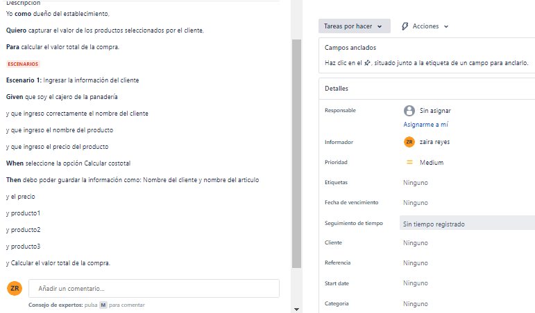
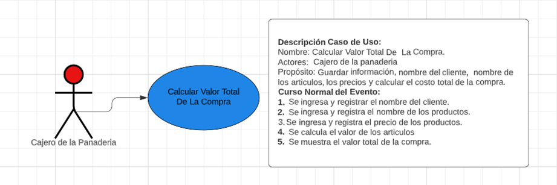
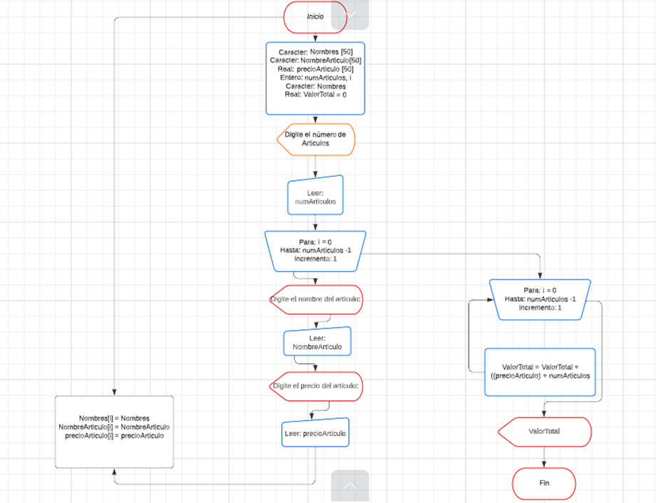

# # PROYECTO N°1
En su labor como Ingeniero de Sistemas a sido seleccionado para desarrollar una aplicación que es requerida para un negocio de panadería, el dueño del establecimiento necesita que se calcule el valor total de la compra del cliente, dependiendo de la cantidad de artículos que a sean seleccionado , facturándolo con el nombre del cliente.
## ACLARACIONES:
•	No se realiza validación de los datos ingresados.
•	La aplicación debe que calcular el costo de los artículos seleccionados y dar a conocer el valor total de la compra.

## APROXIMACIÓN PLANTILLA HISTORIA DE USUARIO:
 

## APROXIMACIÓN CASO DE USO:
 

## APROXIMACIÓN DIAGRAMA DE FLUJO:
 

## APROXIMACIÓN SEUDOCODIGO:
Inicio
     Caracteres: codigos[50], nombres[50]
     Real: productos1[50], productos2[50], productos3[50]
     Caracteres: codigo, nombre
     Entero: numClientes, i
     Real: panuno, pandos, pantres, costototal <- 0
     Imprimir: ‘Digite el número de Clientes:’
     Asignar: numClientes, i
     Para: i=0 hasta numClientes - 1, 1
     Imprimir: ‘Digite el codigo del pedido: ’
     Asignar: codigo
     Imprimir: ‘Digite el nombre del cliente: ’
     Asignar: nombre
     Imprimir: ‘Digite el nombre del producto: ’
     Asignar: producto1
     Imprimir: ‘Digite el precio del producto  ’
     Asignar: panuno    
     Imprimir: ‘Digite el nombre del producto: ’
     Asignar: producto2
     Imprimir: ‘Digite el precio del producto  ’
     Asignar: pandos
     Imprimir: ‘Digite el nombre del producto: ’
     Asignar: producto3
     Imprimir: ‘Digite el precio del producto  ’
     Asignar: pantres 
     codigos[i] <- codigo
     nombres [i] <- nombre
     productos1[i] <- panuno
     productos2[i] <- pandos
     productos3[i] <- pantres
     finPara
     Para i=0 hasta numCLientes -1, 1
     costototal <-
     costototal = costototal + ((panuno[i] + pandos[i] + pantres[i]))
     finPara
     Imprimir:‘Productos comprados: ’    
Fin

